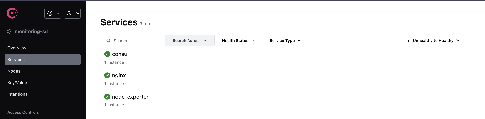
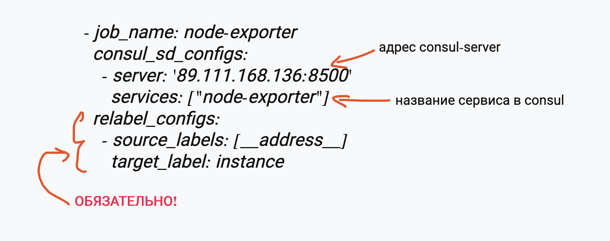
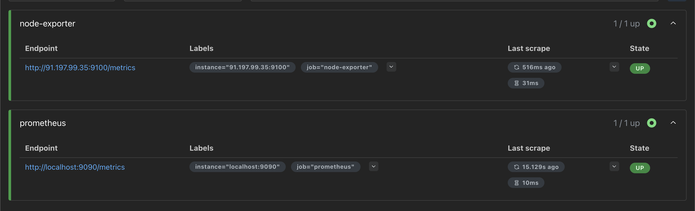

> [!IMPORTANT]
> **Заменить на свои IP-адреса**
> ```bash
> 91.197.99.35 # адрес consul-agent
> 89.111.168.136 # адрес consul-server
> ```

### Настройки
На машине с consul-server
```text
root@cv5980767:/etc# tree consul.d/
consul.d/
└── config.json
```

На машине с consul-agent 
```text
root@cv5953549:/etc# tree consul.d/
consul.d/
├── config.json
├── exporter.json
└── exporter.hcl
```
> [!IMPORTANT]
> **Оставить только один из конфигов:**
> `exporter.json` или `exporter.hcl`, так как они идентичны по сути, отличие лишь в синтаксисе

После того, как consul-agent успешно запустился и подключился к consul-server в UI consul-server смотреть во вкладку **Services**


В конфигурационный файл `prometheus.yml` добавить секцию (см файл https://github.com/AnastasiyaGapochkina01/simple-sd-montoring/blob/main/prometheus.yml)


Если не добавлять `relabel_configs`, то в target'ах будут все эндпоинты всех сервисов вперемешку.

Итог должен получиться такой

